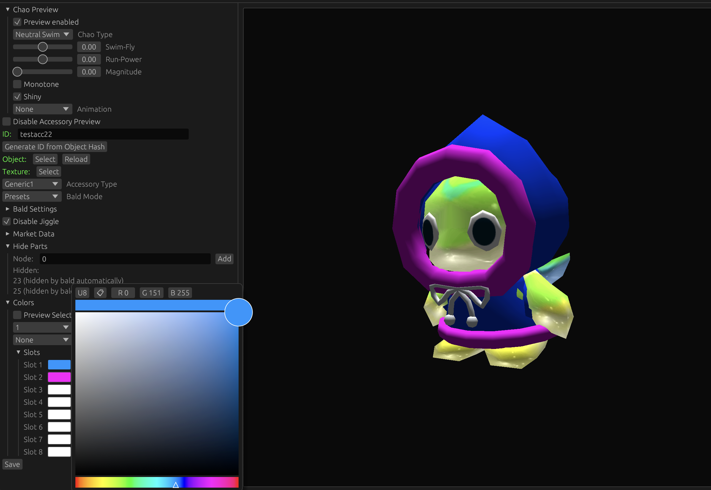
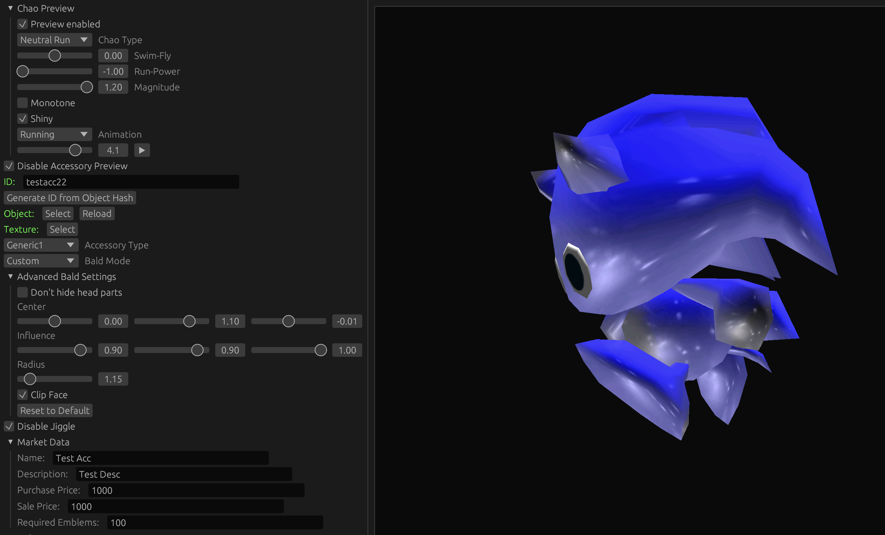

Chao World Extended Editor
=========
## About
A GUI cross-platform editor for making codeless [Chao World Extended](https://github.com/exant64/cwe) API mods. Currently the only supported asset type is accessory editing, starting from CWE 9.6, which is currently in beta. 

The interface has been made with [egui](https://github.com/emilk/egui), using [wgpu](https://github.com/gfx-rs/wgpu) backend, which is also what the rendering preview was made with. The editor is capable of parsing Ninja Chunk Models and various Sonic Adventure 2 texture formats (GVM, PAK).

The Chao rendering code (morphing, face, etc.) has been ported from decomp projects (SADX, [SA2DC match decomp](https://www.github.com/exant64/sa2dc)), with some CWE specific features hacked into the renderer ("bald chao").

## Documentation
Code documentation and editor usage documentation will come in the future.

## Images

